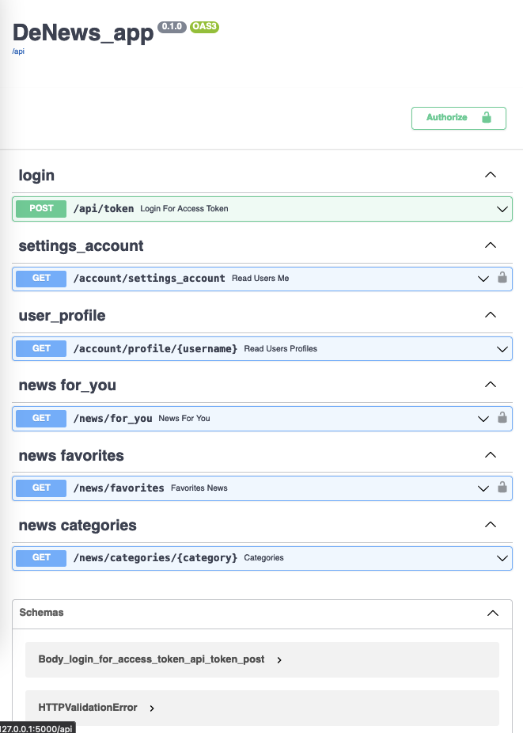

# DeNews

<div>
 
 

</div>

Our backend is built on a Python framework fast-api.  
As a database we use Postgres-SQL. Means of interaction backend <=> DB_SQL we used Python lib - Object Relational Mapper SQLAlchemy ORM.

**FastAPI** is a modern, fast (high-performance), web framework for building APIs with Python 3.7+ based on standard Python type hints.  

For ease of launch whole backed 4-services we used docker-compose file. There are 4 different docker container. 

```
docker-compose up --build
```
Documentaion:
```
http://127.0.0.1:5000/api/docs
```

Schem docker compose
```
 └──docker-compose.yml /
        ├──< Denews_backend is FastAPI service >
        ├──< Postgres SQL Data-Base >
        ├──< PGadmin is tool for managed/look SQL DB >
        └──< Parsing news service >
```

### 1. The FastAPI backend docs will be at  
```
http://localhost:8000/api/docs 
```
Swagger routers - endpoints:

 - ***/api/token*** : *POST-request* Logging/registration based on OAuth 2.0 and JWT token  
 - ***/account/settings_account*** : *GET-request* Users ssettings, credentials
 - ***/account/settings_account*** : *GET-request* Users settings, credentials
 - ***/account/profile/{username}*** : *GET-request* Views other users' accounts
  - ***/news/for_you*** : *GET-request* View a selection of news for you
  - ***/news/favorites*** : *GET-request* News that you have added to favorites for further viewing
  - ***/news/categories/{category}*** : *GET-request* Choosing any category




### 2. Postgres SQL Data-Base

Here the schem relational database:


### 3. PGadmin 

PGadmin is a tool for managing, administration and viewing a database that works like a website
```
http://localhost:5050/
```


### 4. Parsing news and inference classification NLP AI model

**Stage I:** Our backend part have constantly running script which parse news web-pages from prapared list of web-sites.  
We collect and aggregate news sites and the news themselves. 

**Stage II:** After collecting news-pages we make  Inference our AI NLP model for classification news to any of category : [Bitcoin, NFT, Mining, Altcoins] and keep results in Data-base.


## Start frontend
```
cd ./frontend/de-news
npm i --force
npm run dev
```
Main page:
```
http://localhost:3000
```

